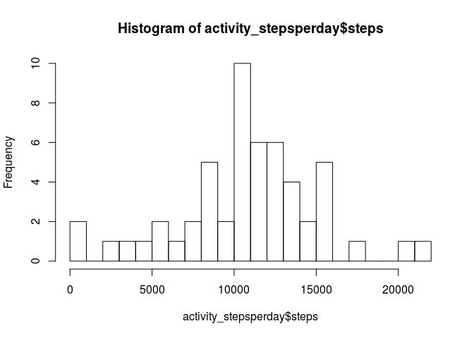
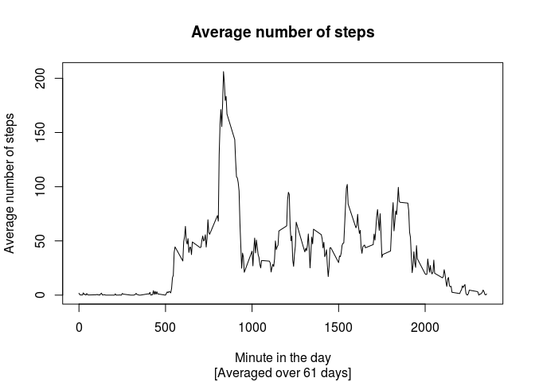
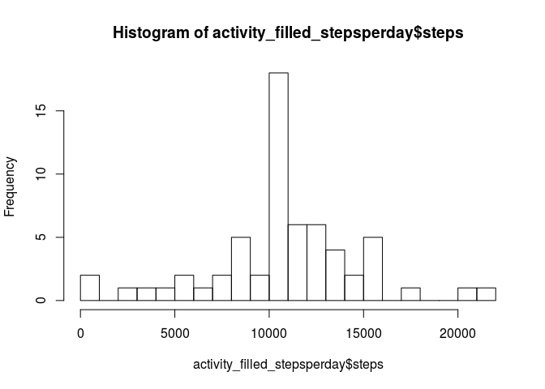
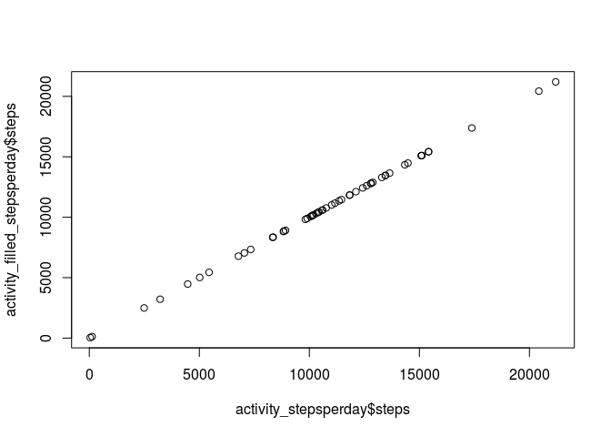

# Reproducible Research: Peer Assessment 1

<!--
source of this file: https://github.com/nuest/RepData_PeerAssessment1

build with knitr::knit2html() does not work, use rmarkdown::render("PA1_template.Rmd")

working directory is assumed to be the one with this file
list.files(getwd())
-->

## Loading and preprocessing the data

```r
datafile <- "./activity.csv"
if(!file.exists(datafile)) {
  utils::unzip("./activity.zip")
}
activity_rawdata <- read.csv(file = datafile)
str(activity_rawdata)
```

```
## 'data.frame':	17568 obs. of  3 variables:
##  $ steps   : int  NA NA NA NA NA NA NA NA NA NA ...
##  $ date    : Factor w/ 61 levels "2012-10-01","2012-10-02",..: 1 1 1 1 1 1 1 1 1 1 ...
##  $ interval: int  0 5 10 15 20 25 30 35 40 45 ...
```

```r
head(activity_rawdata)
```

```
##   steps       date interval
## 1    NA 2012-10-01        0
## 2    NA 2012-10-01        5
## 3    NA 2012-10-01       10
## 4    NA 2012-10-01       15
## 5    NA 2012-10-01       20
## 6    NA 2012-10-01       25
```

```r
tail(activity_rawdata[1000:1100,])
```

```
##      steps       date interval
## 1095     0 2012-10-04     1910
## 1096     0 2012-10-04     1915
## 1097    49 2012-10-04     1920
## 1098    21 2012-10-04     1925
## 1099     0 2012-10-04     1930
## 1100    16 2012-10-04     1935
```

## What is the mean total number of steps taken per day?

### 1. Total number of steps per day


```r
library(dplyr, quietly = TRUE, warn.conflicts = FALSE)
activity_stepsperday <- activity_rawdata %>% group_by(date) %>% summarise(steps = sum(steps))
head(activity_stepsperday)
```

```
## Source: local data frame [6 x 2]
## 
##         date steps
##       (fctr) (int)
## 1 2012-10-01    NA
## 2 2012-10-02   126
## 3 2012-10-03 11352
## 4 2012-10-04 12116
## 5 2012-10-05 13294
## 6 2012-10-06 15420
```

### 2. Histogram


```r
hist(activity_stepsperday$steps, breaks = 24)
```



### 3. Mean and median


```r
mean_steps_per_day <- mean(activity_stepsperday$steps, na.rm = TRUE)
mean_steps_per_day
```

```
## [1] 10766.19
```

```r
median_steps_per_day <- median(activity_stepsperday$steps, na.rm = TRUE)
median_steps_per_day
```

```
## [1] 10765
```

The rounded mean number of steps per day is 10766, the median is 10765.

## What is the average daily activity pattern?

### 1. Time series plot


```r
activity_stepsperinterval <- activity_rawdata %>% group_by(interval) %>% summarise(steps = mean(steps, na.rm = TRUE))
summary(activity_stepsperinterval)
```

```
##     interval          steps        
##  Min.   :   0.0   Min.   :  0.000  
##  1st Qu.: 588.8   1st Qu.:  2.486  
##  Median :1177.5   Median : 34.113  
##  Mean   :1177.5   Mean   : 37.383  
##  3rd Qu.:1766.2   3rd Qu.: 52.835  
##  Max.   :2355.0   Max.   :206.170
```

```r
head(activity_stepsperinterval)
```

```
## Source: local data frame [6 x 2]
## 
##   interval     steps
##      (int)     (dbl)
## 1        0 1.7169811
## 2        5 0.3396226
## 3       10 0.1320755
## 4       15 0.1509434
## 5       20 0.0754717
## 6       25 2.0943396
```

```r
plot(x = activity_stepsperinterval$interval, y = activity_stepsperinterval$steps, type = "l",
     xlab = "Minute in the day", ylab = "Average number of steps", main = "Average number of steps",
     sub = paste("[Averaged over", dim(activity_stepsperday)[1], "days]"))
```



```r
top_intervals <- activity_stepsperinterval %>% top_n(steps, n = 3)
```

### 2. Top interval

The 5-min interval with the maximum number of steps (on average across all days) is the interval starting at minute 835.

## Imputing missing values

### 1. Number of missing values


```r
sum(is.na(activity_rawdata$steps))
```

```
## [1] 2304
```

### 2. Strategy for missing values


```r
replace_na_with_interval_mean <- function(x) {
  replacement_value <- x[["steps"]]
  if(is.na(x[["steps"]])) {
    # fill in average for that interval
    #cat(as.numeric(x[["interval"]]), "\n")
    replacement_value <- activity_stepsperinterval[activity_stepsperinterval$interval==as.numeric(x[["interval"]]),2]$steps
    #cat(x, "using replacement", replacement_value, "\n")
    #steps <- as.numeric(replacement_value)
  }
  as.numeric(replacement_value)
}
```

### 3. Filled data set


```r
activity_filledsteps <- apply(X = activity_rawdata, MARGIN = 1, FUN = replace_na_with_interval_mean)
# replace steps values
activity_filled <- activity_rawdata
activity_filled[,c("steps")] <- activity_filledsteps

# no NAs?
sum(is.na(activity_filled$steps))
```

```
## [1] 0
```

```r
summary(activity_filledsteps)
```

```
##    Min. 1st Qu.  Median    Mean 3rd Qu.    Max. 
##    0.00    0.00    0.00   37.38   27.00  806.00
```

### 4. Analysis of filled dataset


```r
# create histrogram
activity_filled_stepsperday <- activity_filled %>% group_by(date) %>% summarise(steps = sum(steps))
hist(activity_filled_stepsperday$steps, breaks = 24)
```



Mean and median of the filled dataset:


```r
mean(activity_filled_stepsperday$steps)
```

```
## [1] 10766.19
```

```r
median(activity_filled_stepsperday$steps)
```

```
## [1] 10766.19
```

The values differ considerably, especially the mean changed by a factor of 1.
The total number of steps changed from 570608 to 656737.5 (factor of 1.1509434).


```r
plot(x = activity_stepsperday$steps, y = log(activity_filled_stepsperday$steps))
```




## Are there differences in activity patterns between weekdays and weekends?


```r
activity_pattern <- cbind(activity_stepsperday, weekdays(as.Date(activity_stepsperday$date)))
str(activity_pattern)
```

```
## 'data.frame':	61 obs. of  3 variables:
##  $ date                                        : Factor w/ 61 levels "2012-10-01","2012-10-02",..: 1 2 3 4 5 6 7 8 9 10 ...
##  $ steps                                       : int  NA 126 11352 12116 13294 15420 11015 NA 12811 9900 ...
##  $ weekdays(as.Date(activity_stepsperday$date)): Factor w/ 7 levels "Friday","Monday",..: 2 6 7 5 1 3 4 2 6 7 ...
```
http://stats.stackexchange.com/questions/8225/how-to-summarize-data-by-group-in-r
